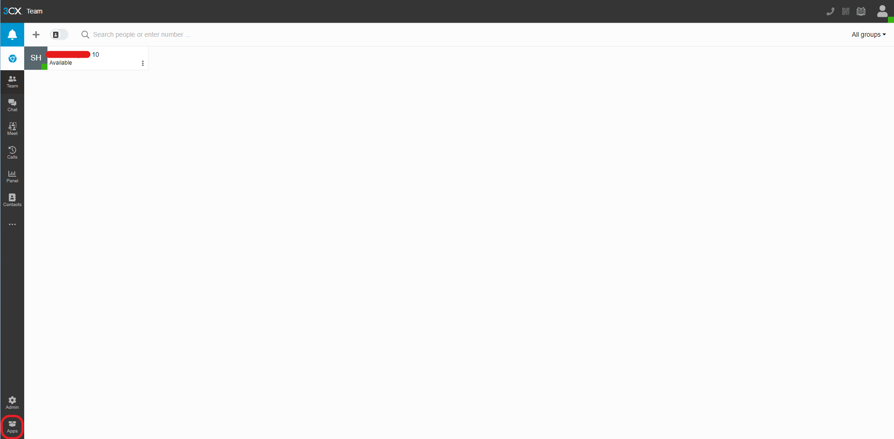
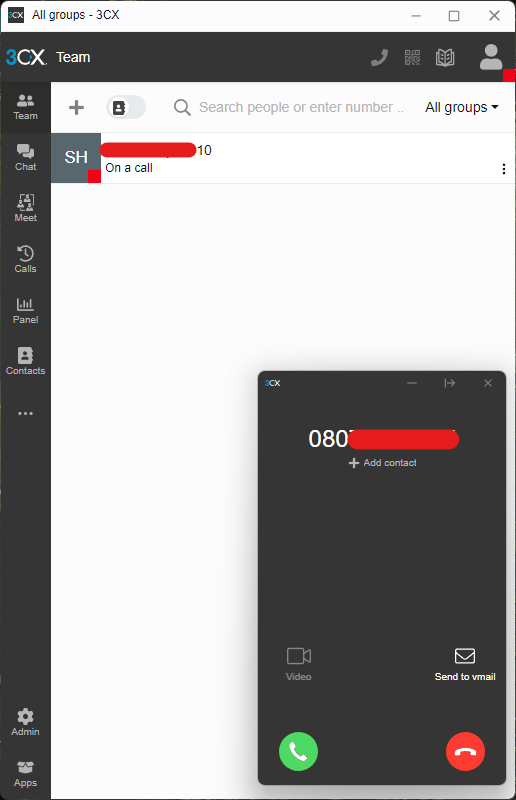

# 3CX の構築

## 前提

- 外線に電話をかけるには、SIP トランクが必要(今回は、**Brastel** を使用)
- 外線に電話、折り返しができるところまでの設定

## 事前準備

まずは、3CX のアカウントを作成(今回は Google アカウントで作成)

## 構築手順

##### **1.** システムを追加をクリック

    

##### **2.** 「3CX Self Hosted / On Premise (PRO / ENT)」をチェックして、Next

    

##### **3.** 「hostname」と「domain」を入力して、Next

    

##### **4.** 「2 Digits」をチェックして、Next

社内のユーザー数に基づいて、内線番号の数を設定

    

##### **5.** 「Country」と「Language」と「Time Zone」と「Prompts」を入力して、Next

    

##### **6.** URL をクリックして、3CX Phone System のインストーラーのダウンロード

> [!WARNING]
> タブを閉じないでください

    

### 以下、3CX Phone System のインストーラーの手順

---

##### **7.** Next

    

##### **8.** Next

    

##### **9.** 許可して、Next

    

##### **10.** Next

    

##### **11.** Install

    

##### **12.** インストールが完了すると、PbxConfigTool.exe が起動されます

    

##### **13.** 「1」を入力

> [!TIP]
> 今回は、ブラウザを使って構築します

    

##### **14.** 開かれたブラウザで「Upload a new configuration file create on 3CX」をチェックして、Next

    

##### **15.** URL Link をチェック

    

##### **16.** 「6. ~~~」で開いていたタブで、Step3 の Download URL をコピー

> [!WARNING]
> タブを閉じないでください

    

##### **17.** コピーした Download URL をコピーして、URL Link にペーストして、Next

    

##### **18.** 構築中なので、待機

    

##### **19.** 構築完了

    

##### **20.** 「6. ~~~」で開いていたタブで、Step4 の URL にアクセス

> [!NOTE]
> Username か Extension と Password をコピー

    

### 以下、3CX Web Client

---

##### **21.** ログイン

    

##### **22.** 3CX Web Client にアクセス完了

    

##### **23.** 鐘マークをクリック

    

##### **24.** ブロックをクリックして、OK

> [!TIP]
> 今回は「Desktop App」を使用するので、ブラウザの通知をさせたくないため、通知をブロックする

    

##### **25.** Admin をクリック

    

##### **26.** M.Console をクリック

    

### 以下、3CX Management Console

---

##### **27.** ログイン

    

##### **28.** 3CX Management Console にアクセス完了

    

##### **29.** SIP Trunks をクリック

    

##### **30.** Add SIP Trunk をクリック

    

##### **31.** 「Select Country」と「Select Provider in your Country」と「Main Trunk No」を入力して、OK

    

##### **32.** 赤枠部分を入力して、OK

    

##### **33.** SIP Trunk 作成完了

    

##### **34.** Inbound Rules をクリック

    

##### **35.** Add DID Rule をクリック

    

##### **36.** 赤枠部分を入力して、OK

    

##### **37.** Inbound Rule 作成完了

    

##### **38.** Outbound Rules をクリック

    

##### **39.** Add をクリック

    

##### **40.** 赤枠部分を入力して、OK

    

##### **41.** Outbound Rule 作成完了

    

### 以下、3CX Web Client

---

##### **42.** Apps をクリック

    

##### **43.** Desktop App をクリック

    

##### **44.** Install をクリック

    

### 以下、3CX Desktop App

---

##### **45.** インストール完了

    

### 以下、3CX Web Client

---

##### **46.** Provision をクリック

    

##### **47.** 「3CX Desktop App を開く」をクリック

    

### 以下、3CX Desktop App

---

##### **48.** 連携されていることを確認

    

##### **49.** 外線に電話をかけられることを確認

    

##### **50.** 折り返しもかけられることを確認

    

外線への電話、折り返しが正常に動作すれば設定完了

> [!TIP]
> 電話がかからない場合、以下を行えばかかるようになることがあります
>
> 1. 再起動をしてください
> 2. 「3CX Management Console」の設定した SIP Trunk の「Authentication」の「Type of Authentication」を「Register/Account based」から「Do not require - IP Based」に変更して保存
> 3. 「3CX Management Console」の設定した SIP Trunk の「Authentication」の「Type of Authentication」を「Do not require - IP Based」から「Register/Account based」に戻して保存

### 3CX Click2Call の設定

---

HTML で「tel 属性」が設定されているところがリンクされるようになり、クリックすると Desktop App が開かれ、リンクされていた電話番号が自動で Desktop App で入力され、すぐに電話することができるようになります

##### **1.** [拡張機能のダウンロード](https://chromewebstore.google.com/detail/3cx-click2call/baipgmmeifmofkcilhccccoipmjccehn?pli=1)

##### **2.** 「Which 3CX App to launch」で「Desktop App」を選択

- 今回は、「Desktop App」 を使用しているので、「Desktop App」 を選択しています
- 「Exception URL list」 は、「3CX Click2Call」 を適用させたくないサイト を「Add」することで無効化させることができます

    

##### **3.** ブラウザで 「tel:080xxxxyyyy」 と入力し、アクセス

「Desktop App」が開かれて正常に動作すれば設定完了

    

### ライセンスが切れてしまった場合

---

ライセンスが切れたシステムを削除し、1 から新しいシステムを構築することで、無料で使い続けることができます
